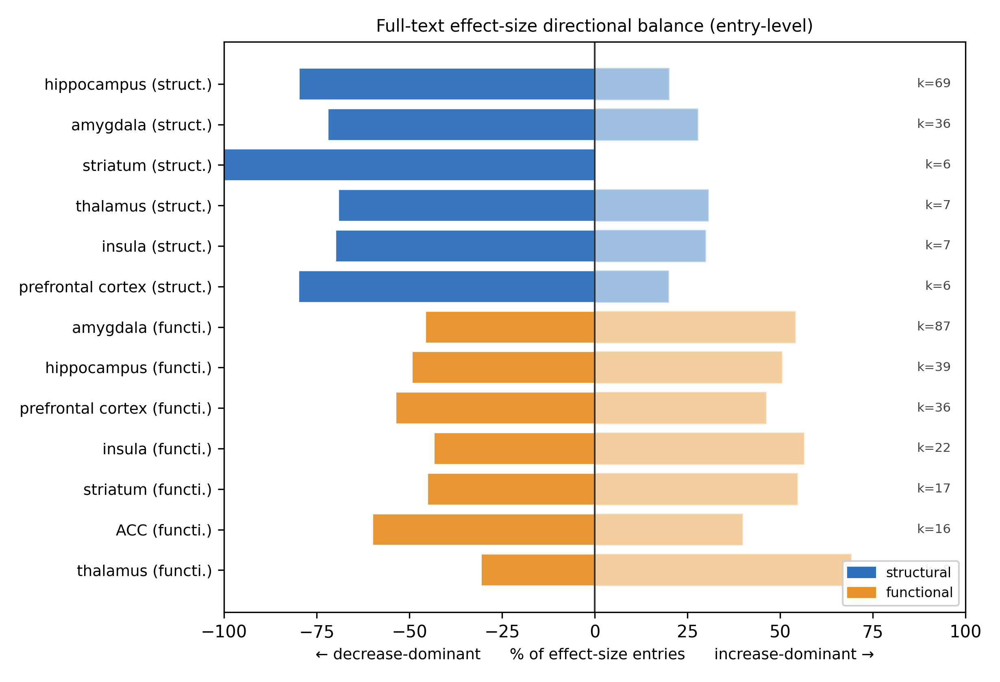
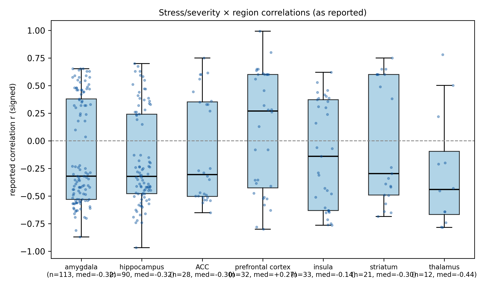

# 보고 패턴에서 추출된 효과 크기로: 전문(Full-Text) LLM 마이닝은 스트레스 관련 뇌 변화의 방향은 복원하지만 그 크기는 부풀린다 — 380편 연구에 걸친 분석

**강병수**  (SYSOFT. 교신저자: shoo99@gmail.com), 2026

> 본 문서는 영문 원고 `manuscript_v2_2.tex`(제출본)의 한글 번역본입니다. 제출은 영문으로 진행되며, 본 한글본은 검토용입니다. 모든 수치는 영문본과 동일합니다.

---

## 초록

**배경.** 동반 연구인 초록 수준 범위 고찰(9,585편, Research Square rs-9884522)은 만성 스트레스가 뇌를 어떻게 변화시키는지에 대한 **문헌 보고 패턴**(방향성 카운트)을 보고하였으며, 이것이 통합된(pooled) 효과 크기가 *아님*을 명시적으로 밝혔습니다. 반복되는 질문은, 전문(full text)에서 실제 수치 효과 크기를 추출했을 때 이러한 카운트 기반 패턴이 유지되는가입니다.

**방법.** 하이브리드 파이프라인을 적용했습니다 — PMC Open Access 전문에서 정규표현식으로 수치 후보를 사전 추출한 뒤, 각 후보를 (뇌 영역, 측정 지표, 방향, 값, 측정 유형) 레코드로 LLM 매핑(Qwen3.6-35B-A3B, llama.cpp, temperature 0의 35B Mixture-of-Experts 모델)하였습니다. 논문 수준 스트레스/질환 맥락 필터와 문장 수준 노이즈 필터(좌우 편측성 비교, 비율, 좌표/클러스터 통계, 보호 요인 및 과제 수행 상관 제거) 적용 후, 뇌 영역 × 측정 지표 부류별로 방향과 크기를 합성하였습니다. 추출이 문장 수준에서 이루어지므로 1차 분석 단위는 문장이 아닌 **연구(study)**입니다: 정확 이항 부호 검정 전에, 연구 × 영역 × 지표별로 다수결 방향 하나로 항목을 축약했습니다. 두 개의 맹검 자동 점검(어휘 기반 *silver* 규칙과 어려운 부분집합에 대한 독립 LLM 교차 점검)으로 방향 정확도를 추정했습니다. 이는 역분산(inverse-variance) 메타분석이 아닌 효과 크기 **합성(synthesis)**입니다: 연구별 표본 크기는 레코드의 약 6%에서만 복원 가능했습니다.

**결과.** 정제된 집합은 380편 연구의 효과 함유 문장 777개(7개 우선 영역의 항목 1,006개)로 구성되었습니다. 규칙 기반 silver 점검에서 어휘적으로 명확한 문장의 96%가 모델과 일치했고(불일치 대부분이 모델 오류가 아닌 silver 규칙 자체의 인공물이므로 이는 보수적 하한), 어려운 사례를 과표집한 50문장 부분집합에 대한 독립 LLM 교차 점검은 **90% 모델 간 일치**(상관-부호 항목은 82%)를 보였습니다. 5건의 불일치 문장을 원문과 대조해 직접 확인한 결과, 실제 증가가 구조적 감소로 잘못 라벨된 경우 — 즉 감소 우세 결론을 부풀릴 수 있는 경우 — 는 하나도 없었습니다. **연구 수준**에서 구조적 감소는 hippocampus에서 강건하게 유의했고(55 대 12편, 부호 *p*=1×10⁻⁷), striatum 신호는 명목상 유의했으나 6편에만 근거했으며(6 대 0, *p*=0.03), amygdala는 연구 수준 집계에서 유의성을 잃었습니다(23 대 13, *p*=0.13) — 그 항목 수준 유의성은 연구 내 군집화의 인공물이었습니다. 기능적 지표는 어느 영역에서도 명확한 방향 신호를 보이지 않았습니다(amygdala 45 대 32편, *p*=0.17; hippocampus 18 대 14, *p*=0.60). 스트레스/중증도와의 *r*형 상관은 amygdala·hippocampus·ACC에서 *r*≈−0.30에 모였습니다. 결정적으로, 이렇게 추출된 크기(*r*≈−0.3 ≈ Cohen's *d*≈−0.68)는 대응되는 개인-환자-데이터(IPD) 메가분석(ENIGMA-PTSD hippocampus *d*=−0.17, amygdala *d*=−0.11)보다 **4–6배 큽니다**. 이는 출판·추출 가능한 문헌이 참 효과 크기를 체계적으로 과장함을 시사합니다. 따라서 전문 마이닝은 정준적 구조 감소 패턴의 **방향은 복원**하지만 그 **출판편향으로 부풀려진 크기를 재현**합니다.

**결론.** 카운트 기반 보고 패턴에서 추출된 효과 크기로 이동하면 스트레스 관련 구조 감소의 *방향*은 확인되지만, 컨소시엄 메가분석 대비 추출 *크기*가 수 배 부풀려져 있음이 드러납니다 — 대규모 LLM 마이닝이 출판편향을 *벗어나는* 것이 아니라 *정량화*할 수 있음을 보여줍니다. 우리는 파이프라인의 방향 신뢰도(어휘적으로 명확한 문장에서 96% silver 일치 — 보수적 하한 — 와 어려운 부분집합에서 90% 모델 간 일치, 모든 불일치를 원문과 직접 대조; 일치 점검 자체는 자동), 매핑 수율(약 43%), 그리고 표본 크기 부재를 투명하게 보고하여, 본 합성과 정식 메타분석 사이의 경계를 명확히 합니다. 포함된 모든 연구 목록은 보충 표 S1로 제공합니다.

**키워드:** 만성 스트레스; 뇌 구조; 효과 크기 합성; 전문 마이닝; LLM 추출; 출판편향; 효과 크기 부풀림; 메가분석 벤치마킹; hippocampus; amygdala

---

## 1. 서론

만성 스트레스 문헌은 소수의 정준적 진술이 지배합니다: 스트레스는 hippocampus 부피를 줄이고, amygdala 반응성을 높이며, 전전두 기능을 손상시킨다. 동반 연구[1]는 CPU 클러스터에서 3,970억 파라미터 LLM을 사용해 9,585편의 PubMed 초록에서 구조화된 방향 라벨을 추출함으로써, 그러한 진술이 **대규모에서 정량적으로** 유지되는지를 검증했습니다. 그 연구는 의도적으로 **보고 패턴**(문헌이 "감소" 대 "증가"를 얼마나 자주 말하는지)을 보고했고, 초록 수준 카운트가 통합 효과 크기가 아님을 강조했으며, 전문 정량 합성을 필수적 다음 단계로 지목했습니다.

본 논문이 그 단계를 밟습니다. 우리는 해당 연구들의 PMC Open Access 부분집합 결과(Results) 절에서 실제 수치 효과 크기(Cohen's *d*, Hedges' *g*, 상관 *r*, *t*/*F* 통계)를 추출하고, 각각을 그것이 기술하는 뇌 영역과 지표에 매핑한 뒤, 하나의 질문을 던집니다: **방향 주장 카운트에서 효과 크기 추출로 이동할 때, 초록 수준 패턴이 유지되는가?** 우리는 이 분야에서 가장 핵심적인 두 패턴 — 구조적 감소, 그리고 초록 수준 고찰이 "amygdala 증가" 논쟁을 해소한다고 주장한 구조-대-기능 해리 — 에 집중합니다.

우리는 이것이 정식 메타분석이 아닌 효과 크기 **합성**임을 분명히 합니다. 전문 문장은 역분산 가중에 필요한 셀별 표본 크기보다 효과 크기를 훨씬 자주 보고합니다. 따라서 우리는 연구 수준 방향 부호 검정과 크기 분포에 의존하고, 추출된 크기를 — 설계상 출판편향이 없는 — 이 분야 최대 규모 개인-환자-데이터(IPD) 메가분석과 대조하여, 독자가 방향이 복원되는지뿐 아니라 크기가 신뢰할 만한지까지 볼 수 있게 합니다. Hippocampus 위축 방향을 복원하는 것 자체는 파이프라인이 작동한다는 **개념 증명(proof of concept)**입니다. 본질적 기여는 그 후반부 — 동일한 LLM 규모 추출이 출판된 문헌의 **출판편향 부풀림**을, 추출된 크기를 편향 없는 벤치마크에 견주어 직접 측정 가능하게 만든다는 점 — 입니다. 따라서 가치는 알려진 패턴을 재확인하는 데 있는 것이 아니라, 수작업 고찰이 도달할 수 없는 규모에서 출판된 추정치와 편향 없는 추정치 사이의 간극을 정량화하는 데 있습니다.

---

## 2. 방법

### 2.1 코퍼스 및 전문 검색
9,585편 초록 코퍼스[1]에서 출발해, PMID를 PMC 식별자로 매핑하고 가용한 PMC Open Access 전문 XML(4,353편)을 검색했습니다. 각 논문의 결과 절(없으면 전체 본문)을 JATS XML에서 파싱했습니다.

### 2.2 정규표현식 사전 추출 (CPU, LLM 미사용)
각 결과 절을 문장으로 분리하고, 정제된 정규표현식으로 수치 효과 크기 후보(*d*, *g*, *r*, *β*, *t*(·), *F*(·), *η*²), 신뢰구간, *p*값, 표본 크기(*n*=·), 뇌 영역 언급을 표시했습니다. 효과 크기 후보를 하나 이상 포함한 문장을 보유하여 LLM 매핑 후보 풀을 만들었습니다. 이 단계는 결정론적이고 재현 가능합니다(`fulltext_hybrid_extract.py`).

### 2.3 LLM 관계 인식 매핑
각 후보 문장을 CPU 클러스터의 35B MoE 모델(Qwen3.6-35B-A3B, llama.cpp, temperature=0)에 보내, 각 수치가 **스트레스 또는 스트레스 관련 질환과의 관계에서** 뇌 영역 지표의 변화를 정량화하는 경우(환자 대 대조군, 스트레스 대 비스트레스, 또는 스트레스/중증도 측정과의 상관)에 *한해* {brain_region, metric, direction, value, measure_type}으로 매핑한 JSON 배열을 반환하도록 프롬프트했습니다. 프롬프트는 회귀 예측변수(연령, 성별, 교육, 약물), 과제 수행 상관, 스캐너/좌표 수치, 보호 요인 효과를 거부하고, 해당 없으면 빈 배열을 내도록 명시적으로 지시했습니다. 출력을 작게 유지하면(<512 토큰) 긴 출력에서 관찰된 양자화 관련 JSON 실패를 피할 수 있습니다. 우리는 동반 연구[1]의 초록 수준 추출에 쓰인 397B 모델 대신 의도적으로 소형 35B MoE 모델을 사용했습니다: 전문 과제는 사전 필터된 단일 문장에 대해 엄격히 제약된 출력 스키마로 작동하므로, temperature 0에서 소형 모델로 충분하면서 CPU 전용 클러스터에서 처리 가능했습니다. 정확한 프롬프트는 부록 A에 그대로 재현합니다.

### 2.4 2단계 노이즈 필터링
**논문 수준** 필터는 코퍼스 맥락이 스트레스/질환 관련인 연구로 매핑을 제한했습니다. 이어지는 **문장 수준** 필터(합성 시 적용)는 모델이 간혹 잘못 매핑한 잔여 노이즈 부류 — 좌우 편측성 비교, 부피 *비율*, MNI 좌표/클러스터 크기/TFCE 통계가 지배하는 문장, 보호 요인 문장, 인지 과제 수행 상관 — 를 제거했습니다. 투명성을 위해 필터 전후 결과를 모두 보고합니다.

### 2.5 합성 (메타분석 아님)
각 (영역, 지표 부류)에 대해 감소/증가/무변화 카운트를 집계했습니다. 추출이 문장 수준이고 단일 연구가 여러 항목을 기여할 수 있으므로, **1차 분석 단위는 문장이 아닌 연구**입니다: 각 연구 × 영역 × 지표 내에서 다수결(동률 제외)로 단일 방향을 배정하고, 연구 수준 방향에 대해 정확 양측 이항 부호 검정(*H*₀: *p*=0.5)을 계산했습니다. 추가로 항목 수준 검정을 민감도 분석으로 보고하되, 연구 내 문장이 독립적이지 않으므로 항목 수준 *p*값은 반보수적(anti-conservative)임을 명시합니다. 무변화/"차이 없음" 문장은 부호 검정에서 제외했으므로, 각 검정은 *방향성 효과를 보고한 연구들 사이의* 방향을 묻습니다. 출판편향 하에서 무변화 자체가 과소 보고되므로, 이는 방향 일관성 검정을 효과의 존재가 아니라 연구가 효과를 보고했다는 조건에 조건화합니다 — 카운트가 통합 효과 추정치가 아닌 또 하나의 이유입니다. 실제로 명시적 무변화는 추출 집합에서 드물었으므로(항목의 <2%; §3.1), 연구 수준 제외의 대부분은 무변화 범주가 아니라 연구 내 *동률*(연구 안에서 감소=증가)에서 발생합니다. 따라서 이 제외는 카운트보다 해석에 더 영향을 줍니다. *r*형 항목에 대해서는 크기 분포(중앙값, IQR)를 요약했습니다. 지표 부류는 구조적(volume, GMV, thickness, FA, density) 대 기능적(activation, connectivity, BOLD, ALFF)으로 구분했습니다. 사용 가능한 표본 크기가 레코드의 약 6%에만 나타났으므로 역분산 무선효과 통합은 시도하지 않았고, 출력을 방향+크기 합성으로 틀 짓고 크기를 외부 벤치마크(§3.7)에 견줍니다.

### 2.6 추출 검증
우리는 두 개의 상보적 자동 일치 점검과 소규모 수작업 판정 단계로 추출을 검증했습니다. 두 *일치* 점검은 **사람 라벨링을 포함하지 않으므로** 어느 것도 사람 기준(human gold standard)이 아니며, 유일한 사람 라벨 단계는 저자가 5건의 교차 점검 불일치를 직접 읽은 것임을 강조합니다(§2.6.1). 첫째, *silver* 점검: 모델 출력에 맹검인 상태에서 명시적 어휘 단서(*reduced/smaller/lower* → 감소; *increased/greater/higher* → 증가; 명확한 단서가 없는 문장은 제외)로 독립적 방향 라벨을 도출하고 모델의 방향 정확도와 감소/증가 혼동 행렬을 계산했습니다. 이 silver 라벨 자체가 표면 단서에서 유도되므로, *이미 어휘적으로 명확한* 문장에서만 모델을 검증할 수 있으며, 방향성 합성에 가장 위험한 어려운 사례 — 부정(negation), "reduced deactivation", 상관-부호 매핑 — 에 대해서는 침묵합니다. 그래서 둘째, *LLM 교차 점검*(§2.6.1)을 추가했습니다.

#### 2.6.1 어려운 부분집합에 대한 독립 LLM 교차 점검
원래 매핑에 맹검인 두 번째 LLM이, silver 점검이 제외한 사례 — 부정, 비활성화/저활성화, 상관(*r*형) 항목 — 를 의도적으로 *과표집*한 층화 50문장 표본의 축약 방향(감소/증가/무변화)을 재라벨했습니다(어휘적으로 명확한 몇 문장을 앵커로 포함). 상관 항목의 경우 재주석자는 상관 부호를, 상관 대상의 부호(예: cortisol/증상 중증도 대 회복탄력성/외상 후 경과 시간)를 읽어 지표 방향으로 매핑했습니다. 이것은 AI 대 AI 교차 점검이며 사람 기준이 *아닙니다*. 두 언어 모델이 체계적 오류를 공유할 수 있으므로, 이는 방향 인공물의 위험을 *한정(bound)*하지만 제거하지는 못합니다. 따라서 우리는 이 어려운 부분집합과 상관 항목에 대해 (정확도가 아닌) 모델 간 *일치*를 보고하고, 추가로 모든 불일치를 수작업 판정합니다: 저자가 원문 문장을 직접 읽어 불일치가 합성을 부풀리는 쪽으로 기우는지 검증합니다(§3.6). 이 5문장 판정이 파이프라인의 유일한 사람 라벨 단계이며, 일치 통계 자체는 자동입니다.

---

## 3. 결과

### 3.1 추출 수율 및 정제
스트레스 맥락 후보 문장 중 933개가 확신 있는 LLM 매핑을 산출했습니다(*매핑 수율* ≈ 43%; 나머지는 "유의하지 않음" 진술과 비적격 수치가 지배하는 빈 배열). 분모가 정규표현식 후보 풀이고 효과 함유 문장의 참 집합을 독립적으로 알 수 없으므로, *재현율(recall)* 대신 *매핑 수율*을 사용합니다. 문장 수준 노이즈 필터가 156문장(약 17%)을 제거하여, **380편 연구의 777문장, 7개 우선 영역의 효과 크기 항목 1,006개**(전 영역 매핑 항목 1,466개)의 정제 집합이 남았습니다. 1,006개 중 **769개가 ≥8개 항목을 가진 셀에서 구조적 또는 기능적 방향을 지니며 표 1의 부호 검정에 들어갑니다**. 나머지 237개는 미분류 지표 유형 항목(218개; 예: 대사물질, 관류)이거나 하위 임계 영역×지표 셀(19개)입니다. 명시적 "무변화/차이 없음" 방향은 드물었으므로(LLM이 항목의 <2%에서만 산출), 방향 카운트는 무변화 범주에 의해 실질적으로 좌우되지 않습니다. 정제는 노이즈를 대체로 대칭적으로 제거했고 핵심 방향은 그대로 유지했습니다.



**그림 1.** 뇌 영역 × 지표 부류별 전문 효과 크기 방향 균형(정제 집합: 777문장, 380편 연구, 7개 우선 영역 1,006항목). 막대는 감소 우세면 좌측, 증가 우세면 우측으로 뻗습니다(효과 크기 항목의 %; 음영이 둘을 구분). *k* = 셀에 항목을 기여한 연구 수로, 항목이 동률 또는 무변화로 귀결되는 연구를 *포함*합니다. 따라서 *k*는 표 1의 연구 수준 감소+증가 카운트(동률/무변화 제외)와 같거나 그보다 큽니다(예: amygdala 기능 *k*=87 대 45+32=77 비동률 연구). 구조 지표(파랑)는 모든 영역에서 감소 우세이며(hippocampus·striatum은 연구 수준에서 강건), 기능 지표(주황)는 유의한 방향 신호가 없습니다. **막대 길이는 항목 수준 비율**(한 연구가 여러 항목을 기여할 수 있어 가성반복으로 합의를 과대 표현 가능)이며, **모든 유의성 주장은 연구 수준**(연구당 다수결 방향 하나)에서 표 1의 부호 검정으로 이루어집니다. amygdala가 경계 사례입니다: 항목 수준 막대는 감소 경향이지만 연구 수준 검정은 비유의(*p*=0.13)합니다.

**표 1.** 뇌 영역 × 지표 부류별 방향 합성(정제 전문 효과 크기). **연구 수준** 부호 검정(연구당 다수결 방향)이 1차 통계입니다. 항목 수준 카운트와 *p*값은 완전성을 위해 제시하나 연구 내 군집화로 인해 반보수적입니다. 부호 검정: 정확 양측 이항, 동률/무변화 제외.

| 영역 | 지표 | 연구 Dec | 연구 Inc | 연구 *p* | 항목 Dec | 항목 Inc | 항목 *p* |
|---|---|---:|---:|---:|---:|---:|---:|
| Hippocampus | structural | 55 | 12 | **1×10⁻⁷** | 135 | 34 | 1.9×10⁻¹⁵ |
| Striatum | structural | 6 | 0 | **0.03** | 14 | 0 | 1.2×10⁻⁴ |
| Amygdala | structural | 23 | 13 | 0.13 | 62 | 24 | 5.1×10⁻⁵ |
| Amygdala | functional | 32 | 45 | 0.17 | 96 | 114 | 0.24 |
| Hippocampus | functional | 14 | 18 | 0.60 | 38 | 39 | 1.0 |
| Prefrontal cortex | functional | 18 | 13 | 0.47 | 29 | 25 | 0.68 |
| ACC | functional | 9 | 7 | 0.80 | 15 | 10 | 0.42 |
| Insula | functional | 10 | 12 | 0.83 | 20 | 26 | 0.46 |
| Striatum | functional | 7 | 7 | 1.0 | 19 | 23 | 0.64 |
| Thalamus | functional | 3 | 5 | 0.73 | 4 | 9 | 0.27 |
| Prefrontal cortex | structural | 4 | 0 | 0.13 | 8 | 2 | 0.11 |
| Thalamus | structural | 4 | 1 | 0.38 | 9 | 4 | 0.27 |
| Insula | structural | 4 | 3 | 1.0 | 7 | 3 | 0.34 |

### 3.2 구조적 지표는 감소 우세
구조 지표 전반에서 모든 영역이 항목 수준에서 감소 우세로 기울었습니다(그림 1, 표 1). **연구 수준**(우리의 1차 단위)에서 구조적 감소는 hippocampus(55 대 12편; 부호 *p*=1×10⁻⁷)와 striatum(6 대 0; *p*=0.03)에서 유의했으나, amygdala에서는 *유의하지 않았습니다*(23 대 13; *p*=0.13): amygdala의 항목 수준 유의성(*p*=5.1×10⁻⁵)은 연구 내 군집화에서 비롯되었고 연구당 단일 방향으로 축약하면 살아남지 못합니다. 전전두피질, insula, thalamus는 방향이 일관되었으나 검정력이 부족했습니다(모두 연구 수준 *p*>0.1). 따라서 강건하고 연구 수준에서 유의한 구조적 감소는 **hippocampus에 국한**됩니다. striatum 신호도 연구 수준에서 유의하나(기여한 6편 중 6편이 감소 보고, *p*=0.03) 가중하기엔 연구가 너무 적고, striatum 구조 감소는 정준적 스트레스 표현형의 일부가 아니므로 시사적인 것으로만 다룹니다. 이는 항목 수준 카운트만으로 시사되는 것보다 좁지만 더 방어 가능한 주장이며, 연구들 자신의 보고 효과 크기를 사용해 정준적 hippocampus 위축 서사와 일치합니다.

### 3.3 기능적 지표는 일관된 방향 신호가 없음
**어떤** 기능적 대조도 연구 수준에서 어느 방향으로도 유의에 도달하지 못했습니다(모두 *p*>0.1; 표 1). 스트레스 하에서 반응성 증가를 보인다고 흔히 기술되는 amygdala는 방향이 평탄했고 — 오히려 약하게 증가로 기울었습니다(증가 45 대 감소 32편, *p*=0.17). hippocampus도 마찬가지였습니다(증가 18 대 감소 14, *p*=0.60). 따라서 기능 신호는 일관된 증가가 아니라 방향적으로 이질적이라고 기술하는 것이 가장 적절합니다.

### 3.4 이중 해리가 아닌 구조-기능 비대칭
두 지표 부류를 나란히 놓으면(그림 1) 참된 이중 해리가 아니라 *비대칭*이 드러납니다. Hippocampus는 강한 구조적 감소(연구 수준 *p*=1×10⁻⁷)와 거의 균형 잡힌 기능 프로파일(*p*=0.60)을 보이고, amygdala는 연구 수준에서 유의한 구조적 감소(*p*=0.13)도, 유의한 기능적 증가(*p*=0.17)도 보이지 않습니다. 진정한 구조-하강/기능-상승 해리라면 기능 대조가 증가 방향에서 유의에 도달해야 하나, 어느 영역에서도 그렇지 않습니다. 따라서 정확한 진술은 *구조는 감소하고(강건하게는 hippocampus에서만) 기능은 일관된 방향 신호를 갖지 않는다*는 것입니다 — 여전히 유익하고, "amygdala 증가" 주장이 구조적 감소보다 약하다는 것과도 부합하지만, 대칭적 해리는 아닙니다.



**그림 2.** 영역별 *r*형 효과 크기 분포(정제 전문). 상자그림은 스트레스 노출/질환 중증도와의 상관 *r*; 점선은 *r*=0. amygdala, hippocampus, ACC는 *r*≈−0.3(중등도 음의 연관)에 모입니다.

### 3.5 원 연구가 보고한 그대로의 상관 크기
*r*형 항목 중 스트레스 노출 또는 질환 중증도와의 상관은 amygdala(중앙값 −0.32, *n*=113), hippocampus(−0.32, *n*=90), ACC(−0.30, *n*=28)에서 *r*≈−0.30에 모여, *보고된 그대로는* 중등도 음의 연관을 나타냈습니다(그림 2) — 그러나 이 보고된 크기는 §3.7에서 편향 없는 벤치마크 대비 약 4–6배 부풀려져 있음이 드러납니다. 전전두피질은 예외로, 양의 경향 중앙값(+0.27, *n*=32)을 보여 이 문헌에서 전전두 상관의 이질적·과제 의존적 성격을 반영합니다.

### 3.6 추출 정확도
어휘 *silver* 규칙을 모든 변화형(감소/증가) 항목에 적용하니, 578개가 명확한 단일 극성 단서를 지녀 비교에 들어갔고, 모델의 매핑 방향이 silver 라벨과 556/578(**96.2%**)에서 일치했습니다. 22건의 불일치는 대칭적 모델 오류가 *아니었습니다*: 수작업 검토(22건을 비식별화하여 `silver_disagreements_deidentified.csv`에 기록; 원문은 PMC 경유) 결과, 14건은 단서 단어가 비교/대조군을 가리키거나("higher gray matter in the control group"), 다영역 문장에서 다른 영역을 가리키거나, 이중 부정("less negative connectivity")을 이룬 *silver 라벨 인공물*이었고 모델의 환자-방향 라벨이 실제로 옳았습니다. 또 다른 4건은 원문 자체가 모순된 문장(서술상 "greater"와 음의 보고 Cohen's *d*가 공존)으로 모델이 수치 부호를 따랐고, 단 4건만이 진정으로 모호했습니다. 따라서 96.2% 일치는 방향 정확도의 보수적 *하한*이며, 원시 혼동 카운트(모델-감소 대 어휘-증가 19건, 그 역 3건)는 모델의 감소 편향이 아니라 "대조군에서 더 큼" 구문의 빈도를 반영합니다. silver 라벨이 모델이 의존하는 동일 표면 단서에서 유도되므로, 이 점검은 어휘 단서가 있는 문장에만 적용됩니다.

50문장 어려운 사례 부분집합에 대한 *LLM 교차 점검*(§2.6.1)에서, 두 번째 모델은 원래 매핑과 **90%**(45/50) *일치*했습니다. 가장 어려운 층(상관-부호 항목)에서 **82%**(14/17), 부정 문장에서 93%(14/15)였습니다. 어느 모델도 정답(ground truth)이 아니므로 이를 정확도가 아닌 모델 간 *일치*로 보고합니다. 5건의 불일치는 표 2와 같이 분포합니다(행=원래 모델 라벨, 열=교차 점검 라벨): 원래 모델은 교차 점검이 동의하지 않은 *4건*에서 "감소"를 배정했고(2건→증가, 2건→무변화), 교차 점검이 표시한 *1건*의 감소를 놓쳤습니다(무변화→감소). 교차 점검을 오류 가능한 참조로 삼아 읽으면, 이 원시 패턴은 오히려 모델이 교차 점검보다 감소를 *더* 쉽게 배정하는 쪽으로 기웁니다. 즉 AI 대 AI 비교*만으로는* 헤드라인을 부풀릴 실패 양식인 경미한 감소 선호 경향을 *배제하지 못합니다*. 그래서 우리는 5개 원문 문장을 직접 읽었습니다 — 파이프라인의 유일한 사람 라벨 단계입니다. 4건의 모델-"감소" 중 2건은 본문상 명백히 옳습니다: "the earlier the first trauma exposure, the *lower* the [¹¹C]P943 BP_ND"(즉 더 낮은 추적자 결합)와 "the cotwin with relatively *higher* cortisol… evinced *lower* connectivity" — 둘 다 교차 점검이 부호를 잘못 읽은 고스트레스→저지표 상관입니다. 나머지 2건은 한 문장에 *두* 방향을 동시에 보고하는 진정으로 모호한 문장(putamen이 "hyperactivation… and… hypoactivation"; 치료 성과-연결성 상관)으로, 어느 것도 헤드라인 영역과 무관합니다. 유일한 무변화→감소 사례는 구조-부피 문장(PTSD 중증도 대 hippocampus *d*=−0.22 *및* amygdala *d*=−0.12, 비유의)으로, 모델이 둘 중 *더 보수적*으로 비유의 효과를 무변화로 매핑한 경우입니다. 결정적으로, 헤드라인 실패 양식 — 실제 증가가 구조적 감소로 추출되는 것 — 은 5건 중 **어디에도** 없었고, 유일한 구조 불일치에서는 모델이 감소를 과대가 아니라 *과소* 호출했습니다. 따라서 교차 점검은 hippocampus 신호에 감소 부풀림 추출 편향의 증거를 제공하지 않으며, 이 결론은 교차 점검 모델만이 아니라 **저자가 5개 원문 문장을 직접 읽은 데** 근거합니다. 더 큰 잔여 불확실성은 방향 부호 검정이 아니라 *r*형 크기 분포(상관-부호 일치 82%)에 있습니다. 두 일치 점검(silver, 교차 점검)은 자동이며, 불일치의 5문장 판정만 수작업으로 수행되었고, 더 큰 추출에 대한 전면적 사람 감사는 향후 과제로 남습니다.

**표 2.** 50문장 어려운 사례 부분집합에 대한 교차 점검 혼동 행렬(§2.6.1). 행=원래 모델 라벨, 열=독립 교차 점검 라벨; 대각합(30+14+1=45)이 모델 간 일치입니다. 5개 비대각 불일치는 §3.6에서 문장별로 검토합니다.

| 모델 ↓ / 교차 점검 → | decrease | increase | null | 합계 |
|---|---:|---:|---:|---:|
| decrease | 30 | 2 | 2 | 34 |
| increase | 0 | 14 | 0 | 14 |
| null | 1 | 0 | 1 | 2 |
| 합계 | 31 | 16 | 3 | 50 |

### 3.7 추출된 크기 대 개인-환자-데이터 메가분석
크기 추정치를 외부 검증하기 위해, 설계상 출판편향이 없는 변연계 구조의 최대 규모 개인-환자-데이터(IPD) 메가분석과 비교했습니다. 중앙값 상관을 Cohen's *d*로 변환하면(*d*=2*r*/√(1−*r*²)): hippocampus *r*=−0.32 → *d*≈−0.68; amygdala *r*=−0.32 → *d*≈−0.68; ACC *r*=−0.30 → *d*≈−0.63. 대응되는 IPD 추정치는 뚜렷이 더 작습니다: ENIGMA-PTSD는 hippocampus *d*=−0.17, amygdala *d*=−0.11(후자는 다중비교 보정에서 생존 못함)을 보고했고[2], ENIGMA-MDD는 hippocampus *d*=−0.14(재발성 −0.17)을 보고했습니다[3]. 두 가지 단서가 이 비교를 날카롭게 합니다. 첫째, 추정 대상이 다릅니다: IPD 연구는 환자-대조군 *집단* 차이를 추정하지만, 우리 *r*형 항목의 상당 부분은 이환 표본 내 *중증도* 상관입니다. 이들은 상호 교환 불가하므로, 아래 비율은 보정된 편향 계수가 아니라 자릿수 수준의 불일치로 읽어야 합니다. 둘째, 가장 깔끔한 동종 벤치마크는 중증도 자체이며, 거기서 간극이 가장 큽니다: ENIGMA-MDD는 증상 중증도와 영역 부피 사이에 *아무런* 연관을 찾지 못했으나[3], 우리의 추출 중증도 상관은 *r*≈−0.3에 모입니다 — 어떤 단일 배수로도 포착되지 않는 질적 불일치(무 대 중등도). 집단 차이 항목에 대해 우리의 추출 크기는 편향 없는 벤치마크를 약 4–5배(hippocampus, 어느 컨소시엄 추정치를 분모로 쓰느냐에 따라)에서 약 6배(amygdala)까지 초과합니다. 우리 파이프라인이 각 논문에서 *보고된*, 대개 유의한 효과를 우선적으로 복원하므로, 이 비율들은 오히려 참 보고 부풀림의 보수적 하한입니다. 따라서 우리 합성의 *방향*은 기준(gold standard)과 일치하지만, 그 *크기*는 출판 가능 문헌에서 크고 유의한 효과를 선택적으로 보고한 것을 반영합니다.

---

## 4. 논의

핵심 결과는 양면적입니다. *방향*에서 전문 마이닝은 안심을 줍니다: hippocampus의 스트레스 관련 구조적 감소가 연구 수준 방향 유의성(*p*=1×10⁻⁷)으로 복원되어, 우리 초록 수준 카운트와 컨소시엄 메가분석 모두와 일치합니다. *크기*에서는 수정주의적입니다: 추출된 상관(*r*≈−0.3 ≈ *d*≈−0.68)이 편향 없는 메가분석 효과(*d*≈−0.14 ~ −0.17)를 4–6배 과장합니다. 따라서 초록 수준과 전문 *카운트* 사이의 일치는 문헌이 편향 없음을 입증하지 *않습니다* — 둘 다 동일한 상류 출판편향을 물려받으며, 우리의 크기 비교가 그것을 가시화합니다. 따라서 본 연구의 기여는 단지 서사를 확인하는 것이 아니라, LLM 규모 마이닝이 출판된 추정치와 편향 없는 추정치 사이의 *간극을 정량화*할 수 있음을 보이는 데 있습니다.

이는 방법론적으로 중요하지만, 교훈은 깔끔한 검증의 *반대*입니다. 초록 수준 방향 카운팅이 저자들이 초록을 표현하는 방식의 인공물일 수 있다는 우려가 가능합니다. 전문 카운트가 같은 방향으로 떨어지는 것은 *표현* 인공물은 배제하지만, 무엇이 애초에 출판되느냐에 작용하는 — 초록과 결과 절이 똑같이 공유하는 — *출판* 편향은 배제하지 못합니다. IPD 메가분석과의 비교(§3.7)가 이를 구체화합니다: 초록 수준과 전문 추정치 모두 편향 없는 벤치마크 대비 동일한 수 배 크기 부풀림을 지닙니다. 실질적 함의는, 출판된 텍스트의 LLM 규모 마이닝이 *방향*과 *출판편향 간극 정량화*에는 신뢰할 만한 도구이지만, 편향 없는 크기가 목표일 때 IPD 통합을 대체하지는 못한다는 것입니다. 두 번째 냉정한 관찰은, amygdala 구조적 감소(항목 수준에서는 유의하나 연구 수준에서는 아님)가 문장 수준 분석에서는 과대 주장되었을 것이라는 점입니다. 연구 수준 집계는 형식이 아니라 가성반복적 위양성에 대한 방어책입니다.

### 4.1 한계
우리는 틀 짓기에서 의도적으로 보수적입니다. 첫째, **이것은 통합 메타분석이 아닙니다**: 연구별 표본 크기가 레코드의 약 6%에서만 추출 가능해 역분산 가중이 불가하므로, 대신 방향 부호 검정과 크기 분포를 보고합니다. 둘째, **매핑 수율이 중등도입니다**(스트레스 맥락 후보 문장의 약 43%가 확신 있는 매핑을 산출). 미매핑 문장은 무변화 결과와 비적격 수치가 지배하지만 일부 참 효과를 놓치므로, 카운트는 하한입니다. 셋째, **가성반복.** 추출이 문장 수준이라 단일 연구가 여러 항목을 기여할 수 있어 소박한 부호 검정의 독립성 가정을 위반합니다. 우리는 연구를 1차 단위로 삼아(연구 × 영역 × 지표당 다수결 방향; §2.5) 이를 다루며, 항목 수준 카운트는 투명성을 위해서만 유지합니다. amygdala 결과는 이 구분이 형식이 아니라 실질임을 보여줍니다. 잔여 비독립성은 남으므로(연구들이 방법·집단·분야 수준 사전 신념을 공유), 연구 수준 유의성조차 역분산 통합과 동등하지 않습니다. 넷째, **표 세기(vote-counting)는 알려진 한계의 합성법입니다**: 효과 크기와 연구별 정밀도를 무시하며, 검정력이 부족한 구성 연구들에서는 연구 수가 늘수록 잘못된 결론에 수렴할 수 있습니다[4,5]. 우리 부호 검정은 통합 효과 추정이 아니라 출판된 기록에서의 방향 일관성 검정으로 읽어야 합니다. 다섯째, **크기는 출판과 유의성에 조건화됩니다**("승자의 저주"). §3.7은 이를 IPD 메가분석 대비 4–6배 간극으로 정량화하며, 연구별 표본 크기 없이는 깔때기 도표나 trim-and-fill을 적용할 수 없으므로, 중앙값 *r*은 편향 보정된 모집단 효과가 아니라 선택된 표본의 상향 치우친 요약입니다. 여섯째, **구성 개념 혼합**: 예측변수 "스트레스 노출/질환 중증도"는 구조와의 관계가 그럴듯하게 다른 이질적 구성 개념(만성 스트레스, PTSD, MDD, 초기 생애 역경, cortisol, 지각된 스트레스)을 모읍니다(예: ENIGMA-MDD는 중증도-부피 연관을 찾지 못함). 그림 2의 넓은 IQR이 이와 부합하며, 노출 유형별 층화 합성은 명백한 향후 과제입니다. 일곱째, 코퍼스는 특정 저널을 과대 대표하는 PMC Open Access 부분집합입니다. 여덟째, **우리 검증은 방향 정확도를 확립하지 정량적 정밀도를 확립하지 않습니다**: silver와 교차 점검 감사는 모두 추출 효과의 부호가 옳은지를 채점하며, 파이프라인이 각 *r* 또는 *d*의 정확한 수치를 복원한다고 주장하지 않습니다. 잘못 파싱된 크기(예: 신뢰구간 경계를 점추정치로 읽음, 또는 편상관 대 영차 상관)는 방향 전용 점검으로 잡히지 않으므로, 그림 2의 크기 분포는 §3.7에서 정량화한 출판편향 부풀림 위에 자체 잔여 추출 노이즈를 더한, 우리 파서가 복원한 *보고된* 값으로 읽어야 합니다. 추출 크기를 손으로 읽은 값과 대조하는 수치 감사는 명백한 향후 과제입니다. 이러한 경계가 바로 본 효과 크기 *합성*을, 우선 영역에 대한 연구별 효과/표본 크기의 수동 큐레이션을 요구하는 등록 메타분석과 구분하는 지점입니다.

### 4.2 결론
380편 연구에 걸친 전문 효과 크기 합성은 연구들 자신의 수치로 스트레스 관련 hippocampus 구조 감소의 *방향*을 복원하지만, 편향 없는 IPD 메가분석 대비 추출 *크기*가 4–6배 부풀려져 있음을 보입니다. 따라서 출판된 텍스트의 LLM 규모 마이닝은 방향과 분야의 출판편향 *정량화*에는 신뢰할 만한 도구이지만 — 그것을 벗어나는 도구는 아닙니다. 우리는 파이프라인의 방향 신뢰도를 난이도별로 정직하게 보고합니다(어휘적으로 명확한 문장에서 96% silver 일치 — 보수적 하한 — 와 부정·상관-부호 매핑을 강화한 어려운 부분집합에서 90% 모델 간 일치; 저자의 불일치 문장 읽기에서 감소 부풀림 오류는 발견되지 않음), 매핑 수율(약 43%), 표본 크기 부재도 함께 보고하여, 본 합성과 정식 메타분석 사이의 경계를 명시합니다.

---

## 데이터 및 코드 가용성
- 포함된 모든 연구의 완전한 목록(PMID, 제목, 저널, 연도, PMC ID): 보충 표 S1.
- 원 초록/전문: 보충 표 S1의 식별자를 통해 각 논문의 라이선스 하에 PubMed/PMC에서 조회 가능.
- 추출·합성 코드(`fulltext_hybrid_extract.py`, LLM 매핑 러너, 합성/부호 검정 스크립트), 정확한 LLM 프롬프트(부록 A), 비식별화된 LLM 매핑 효과 크기 레코드는 https://github.com/shoo99/ai-drug-target (디렉터리 `paper3/`)에 공개되어 있습니다.

## 동반 프리프린트
본 연구는 초록 수준 범위 고찰을 확장합니다: Kang B. (2026), *Large-Scale Scoping Review of Chronic Stress-Induced Brain Changes via LLM-Powered Extraction of 9,585 Studies*, Research Square, 10.21203/rs.3.rs-9884522/v1.

## 감사의 글
LLM 추출은 분산 CPU 클러스터(GPU 없음)에서 수행되었습니다. 원고 준비는 Claude(Anthropic)의 도움을 받았습니다. 저자가 모든 과학적 내용에 대한 전적인 책임을 집니다.

## 이해 상충
저자는 이해 상충이 없음을 선언합니다.

---

## 부록 A. LLM 추출 프롬프트 (그대로)
각 후보 문장은 채팅 템플릿 `<|im_start|>user … <|im_end|><|im_start|>assistant`로 감싸고, 미리 닫힌 `<think></think>` 블록(no-think 모드)과 다음의 one-shot 예시 및 지시를 함께 제시했습니다:

```
Example 1 (map: stress->region effect) —
Sentence: "Patients with PTSD showed reduced hippocampal volume vs controls
(Cohen's d=-0.45), and amygdala activation correlated with cortisol (r=0.38)."
Output: [{"brain_region":"hippocampus","metric":"volume","direction":"decrease",
"value":-0.45,"measure_type":"d"},{"brain_region":"amygdala",
"metric":"activation","direction":"positive_correlation","value":0.38,
"measure_type":"r"}]

[the candidate sentence + its regex-detected numbers are inserted here]

This sentence is FROM A CHRONIC-STRESS / STRESS-DISORDER STUDY (PTSD,
depression/MDD, early-life stress, trauma, high cortisol), so a brain-region
group difference or change reported here IS the stress/disorder effect — MAP IT.
Map a number when it quantifies a BRAIN REGION'S metric (volume, GMV, thickness,
activation, connectivity, FA, metabolite) as: patients vs controls, stressed vs
non-stressed, a within-patient change, or a correlation with a stress/severity
measure. direction = how the region's metric goes in the PATIENT/STRESSED/
higher-severity state (decrease/increase/positive_correlation/
negative_correlation/null). DO NOT map regression predictors (age, sex,
education, medication), task-performance correlations, scanner/coordinate
numbers, or protective-factor effects. Output ONLY a JSON array of
{brain_region, metric, direction, value, measure_type}; [] if none qualify.

Example 2 (nothing to map -> empty output) —
Sentence: "Reaction times were slower in the patient group (mean 612 vs 548 ms,
p=0.02), and head motion did not differ between groups (p=0.41)."
Output: []
(No brain-region metric is quantified: reaction time is task performance and head
motion is a nuisance covariate, so the correct output is the empty array.)
```

## 참고문헌
1. Kang B. Large-Scale Scoping Review of Chronic Stress-Induced Brain Changes via LLM-Powered Extraction of 9,585 Studies. *Research Square* (2026). DOI: 10.21203/rs.3.rs-9884522/v1.
2. Logue MW, van Rooij SJH, Dennis EL, et al. Smaller Hippocampal Volume in Posttraumatic Stress Disorder: A Multisite ENIGMA-PGC Study. *Biol Psychiatry* 2018;83(3):244–253. doi:10.1016/j.biopsych.2017.09.006.
3. Schmaal L, Veltman DJ, van Erp TGM, et al. Subcortical brain alterations in major depressive disorder: findings from the ENIGMA Major Depressive Disorder working group. *Mol Psychiatry* 2016;21:806–812. doi:10.1038/mp.2015.69.
4. Hedges LV, Olkin I. *Statistical Methods for Meta-Analysis*. Academic Press, 1985.
5. Borenstein M, Hedges LV, Higgins JPT, Rothstein HR. *Introduction to Meta-Analysis*. Wiley, 2009.
